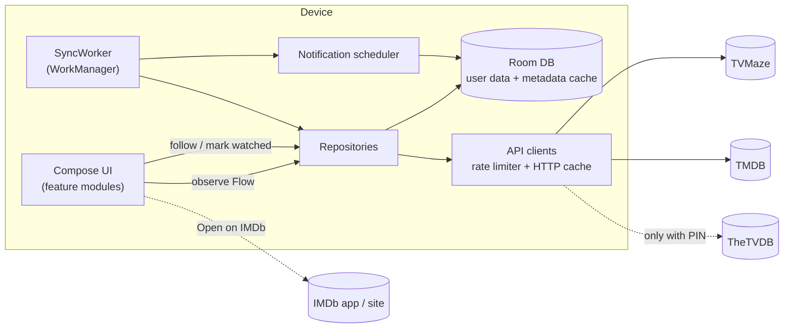

# Coulendar — Android Development Plan

Coulendar is an offline-first Android app that lets a user follow TV shows and
movies and see what is coming up and what they have watched. All
data is fetched directly from public metadata APIs and stored and processed
on the device. There is no backend, no account, and no analytics.

---

## 1. Decisions

| Topic | Decision | Consequence |
|---|---|---|
| IMDb | **IDs + deep links only.** No IMDb API calls. | IMDb `tt…` IDs (from TVMaze/TMDB) serve as the cross-source join key and "Open on IMDb" target. Avoids the AWS Data Exchange API (~$150k/yr, non-commercial-only terms, credentials can't be shipped in an app). |
| TV data | **TVMaze is the primary source** for shows, episodes and airtimes. | Free, keyless, CC BY-SA 4.0. Has no movies. |
| Movie data | **TMDB is added** as the movie source. | Free for non-commercial use with attribution; has per-region release dates by type. |
| TheTVDB | **Optional enhancement**, unlocked when the user enters their own TVDB subscriber PIN. | Ship a TVDB *user-supported* project key; app is fully functional without TVDB. |
| Distribution | **F-Droid + Google Play**, GPLv3. | No proprietary dependencies (no Play Services/Firebase), keys live in source, reproducible builds, must target API 36 for Play. |
| v1 scope | **Upcoming calendar, release notifications, watched tracking.** | Widget, device-calendar export, imports, where-to-watch → post-v1 backlog (§13). |

---

## 2. Data sources

| | TVMaze | TMDB | TheTVDB (optional) | IMDb |
|---|---|---|---|---|
| Role | Canonical TV source: shows, seasons, episodes, airstamps, schedule | Canonical movie source: details, release dates per region/type, posters | Extra artwork, alternate episode orderings (DVD/absolute — useful for anime), extra IDs | Join key + outbound links |
| Auth | None | Project API key / read-access token | Project *user-supported* key + **user's subscriber PIN** → `POST /login` → bearer token (valid ~1 month) | — |
| Limits | ~20 calls / 10 s per IP; HTTP 429 when exceeded; responses are edge-cached | Throttled per IP (commonly cited ~40–50 req/s); 429 when exceeded | Undocumented; be conservative | — |
| Terms | Data CC BY-SA 4.0, credit + link required; commercial use needs a license | Non-commercial free; TMDB logo + "This product uses the TMDB API but is not endorsed or certified by TMDB." in About/Credits | "Metadata provided by TheTVDB" + link wherever TVDB data is shown | Don't use IMDb logo or data; text link only |

### Endpoints the app will use

**TVMaze** (`https://api.tvmaze.com`)
- `GET /search/shows?q=` — search
- `GET /lookup/shows?imdb=tt…` / `?thetvdb=…` — resolve by external ID
- `GET /shows/{id}?embed[]=nextepisode&embed[]=previousepisode` — show + `externals {imdb, thetvdb, tvrage}`, `network.country.timezone`, `webChannel`, `status`, `updated`
- `GET /shows/{id}/episodes?specials=1` — full episode list incl. specials (`airdate`, `airtime`, `airstamp`, `runtime`, `type`)
- `GET /shows/{id}/seasons`
- `GET /updates/shows?since=day|week|month` — `{showId: updatedEpoch}` map; drives incremental sync

**TMDB** (`https://api.themoviedb.org/3`)
- `GET /search/movie?query=&region=&language=`
- `GET /movie/{id}?append_to_response=release_dates,external_ids` — one call per movie refresh
- `GET /find/{tt…}?external_source=imdb_id` — resolve by IMDb ID
- `GET /configuration` — image base URLs/sizes (cache for days)
- Release types: 1 Premiere, 2 Theatrical (limited), 3 Theatrical, 4 Digital, 5 Physical, 6 TV

**TheTVDB v4** (`https://api4.thetvdb.com/v4`)
- `POST /login {apikey, pin}`
- `GET /search/remoteid/{tt…}` — map IMDb ID → TVDB ID
- `GET /series/{id}/extended`, `GET /series/{id}/episodes/{season-type}` (`default`, `dvd`, `absolute`, …), `GET /series/{id}/artworks`
- `GET /updates?since={epoch}&type=series`

**IMDb** — `https://www.imdb.com/title/{tt…}/` opened with an `ACTION_VIEW` intent. If the IMDb app is installed, its App Links handle the URL. Otherwise a Custom Tab opens it.

---

## 3. Architecture

Offline-first, single source of truth: **the UI only ever reads from Room**.
Network code only writes into Room. Sync runs in WorkManager.



### Module layout

```
app/                     Application, MainActivity, nav graph, DI wiring
core/model/              Pure-Kotlin domain models (Title, Episode, Release, …)
core/database/           Room DB, entities, DAOs, migrations, schema JSON
core/network/            tvmaze/, tmdb/, tvdb/ clients + DTOs, rate limiter, auth
core/data/               Repositories, source merging, SyncEngine
core/notifications/      Channels, scheduling, notification builders
core/ui/                 Theme, design-system composables, image loading
feature/search/
feature/calendar/
feature/library/         Followed titles, progress, "Up next"
feature/details/         Show / season / episode / movie screens
feature/settings/        Region, notifications, TVDB PIN, keys, backup, attributions
```

### Tech stack (all FOSS, F-Droid-compatible)

| Concern | Choice |
|---|---|
| Language/UI | Kotlin, Jetpack Compose, Material 3 (dynamic color) |
| Navigation | Navigation Compose (type-safe routes) |
| DI | Hilt |
| Networking | Retrofit + OkHttp (disk cache) + kotlinx.serialization |
| Storage | Room (KSP), DataStore for preferences |
| Background | WorkManager |
| Images | Coil 3 |
| Calendar UI | `kizitonwose/Calendar` (MIT) for the month grid |
| Time | `java.time` (no desugaring needed at minSdk 26) |
| Secrets at rest | Android Keystore-backed encryption (e.g. Tink) for the TVDB PIN |
| Testing | JUnit, Turbine, MockWebServer, Robolectric, Compose UI test, Room in-memory |
| Quality | Android Lint, detekt/ktlint, Gradle version catalog, dependency verification |

SDK levels: **minSdk 26**, **targetSdk/compileSdk 36**. Play has required
API 36 for new apps and updates since Aug 31, 2026.

---

## 4. Data model (Room)

**Key rule:** keep *user data* separate from the *metadata cache*. The cache
can be wiped and rebuilt at any time. User data is keyed by **stable external
IDs**, so a metadata refresh never orphans watch history.

User data (backed up and exported):
- `follow` — `(kind SHOW|MOVIE, sourceId)` PK where sourceId = TVMaze show ID or TMDB movie ID; `followedAt`, `notify: Boolean`, `archived`
- `episode_watch` — `(tvmazeEpisodeId)` PK, `tvmazeShowId`, `watchedAt`, `plays`
- `movie_watch` — `(tmdbMovieId)` PK, `watchedAt`, `plays`
- DataStore prefs: region, language, notification mode/time, include specials, TVDB PIN (encrypted), optional TMDB key override

Metadata cache (rebuildable):
- `show` — tvmazeId PK, name, overview, status, network/webChannel, `originTimeZone`, runtime, poster/backdrop URLs, `sourceUpdatedAt`, `lastFetchedAt`
- `external_id` — `(kind, localId, source[TVMAZE|TMDB|TVDB|IMDB], value)`, unique `(source, value)`
- `season` — tvmazeId PK, showId, number, name, premiereDate, endDate
- `episode` — tvmazeId PK, showId, season, number, name, `airstamp: Instant?`, `airdate: LocalDate?`, `hasAirtime`, runtime, `type` (regular / significant_special / insignificant_special), summary, image
- `movie` — tmdbId PK, title, overview, runtime, poster/backdrop, status, `lastFetchedAt`
- `movie_release` — `(tmdbId, region, type)`, `date: LocalDate`, certification, note
- `tvdb_enrichment` — showId, tvdbId, artwork URLs, alternate-ordering availability
- `notification_log` — `eventKey` PK, `notifiedAt` (dedupe)
- `sync_state` — per source: last incremental cursor, last full sync

Derived via SQL views/queries (no stored duplicates):
- **Calendar events** = followed-show episodes in `[from, to)` ∪ followed-movie releases (user region, enabled types) in `[from, to)`
- **Progress** = watched ÷ aired regular episodes (specials optional)
- **Up next** = first unwatched aired episode per followed show, ordered by last watch activity

Export Room schemas (`exportSchema = true`) and write a migration test for every schema version from v1 on.

---

## 5. Identity and merge rules

- **Shows:** TVMaze ID is canonical. IMDb and TVDB IDs come from TVMaze
  `externals`. Search results, imports and pasted IMDb links all resolve to a
  TVMaze ID before the show is followed.
- **Movies:** TMDB ID is canonical. The IMDb ID comes from `external_ids`. When a
  PIN is set, the TVDB ID comes from `/search/remoteid/{tt…}`.
- **Field precedence**

  | Field | Primary | Fallback |
  |---|---|---|
  | Episode list, airstamps, show status | TVMaze | — |
  | Movie release dates | TMDB (user region) | TMDB primary release date |
  | Posters/backdrops | TVDB (if PIN + user preference) | TVMaze / TMDB |
  | Overview text | TVMaze / TMDB | TVDB (if PIN) for missing translations |
  | Alternate orderings | TVDB only | — |

- TVDB episodes are **not merged** into the canonical episode list in v1. Their
  numbering often differs from TVMaze, so merging them risks corrupting watch history.
  Alternate orderings are a post-v1, read-only view.

---

## 6. Sync engine

**Triggers**
1. Follow → expedited one-time work for that title (results visible within seconds).
2. Periodic `SyncWorker` every 12 h (constraints: network connected, battery not low). An optional setting limits it to unmetered networks.
3. Pull-to-refresh on Calendar/Library → one-time sync of all followed titles.

**Steps in a periodic run**
1. **TVMaze incremental:** `GET /updates/shows?since=day`. Use `week` if the last sync was more than a day ago and `month` if more than a week ago. Beyond a month, refresh every followed show. Refetch only followed shows whose `updated` timestamp is newer than the stored one, with 2 calls each (`/shows/{id}` + `/episodes?specials=1`). Upsert in a single transaction and delete episodes the source removed. Watch history is untouched because it is keyed by episode ID.
2. **TMDB:** refresh followed movies that are not yet released in the user's region. Refresh daily if a release is within 30 days, weekly otherwise, and monthly once released.
3. **TVDB (PIN only):** refresh the token if it expires within 3 days. Call `/updates?since=` and refetch artwork for followed shows that changed.
4. **Reschedule notifications** for the next 48 h (§7.4).

**Networking rules**
- A per-host token-bucket OkHttp interceptor (TVMaze 20/10 s, TMDB ~20/s, TVDB ~5/s).
- On 429/5xx, honor `Retry-After` and back off exponentially. If the budget is exhausted, the worker returns `Result.retry()`.
- 50 MB OkHttp disk cache. TVMaze responses are CDN-cached, so polling more often than about hourly gains nothing.
- Bulk operations (e.g. importing 300 titles) go through a queue that reports progress, so they never burst past the limits.

---

## 7. v1 features

### 7.1 Search and follow
- One search screen that queries TVMaze `/search/shows` and TMDB `/search/movie` in parallel with a 300 ms debounce. Results are merged and show a type badge, year, network or release year, and poster.
- Pasting an IMDb URL or `tt…` ID resolves it through TVMaze `/lookup/shows?imdb=` and TMDB `/find`, which covers the common "share from the IMDb app" case.
- A Coulendar **share target** (`ACTION_SEND` text/plain) accepts IMDb links shared from the IMDb app or a browser.
- Follow/unfollow from a result or a detail screen. The first follow triggers the notification permission prompt (§7.4).

### 7.2 Details
- **Show:** hero art, status (Running / Ended / TBD), network or streaming service, next-episode countdown, overview, seasons → episode list with watched checkboxes, "Open on IMDb", source attribution footer.
- **Movie:** release timeline for the user's region (premiere / theatrical / digital / physical / TV), other regions expandable, watched toggle, "Open on IMDb", attribution.
- **Episode:** air date/time in local time, runtime, summary, mark watched.

### 7.3 Calendar (home screen)
- **Agenda view** (default): sticky day headers, starting at "today −7 days" and scrolling forward. Each entry shows the poster, title, SxxEyy and name or the release type, and the local time.
- **Month view:** a grid with dots per day. Tapping a day shows that day's list.
- Filters: TV / Movies / both, and hide watched.
- Grouping: several episodes of one show with the same airstamp (streaming drops) collapse into "Season 3 · 8 episodes".
- TBA episodes (no airdate) appear in a "Coming later" section on the show screen, not in the calendar.

### 7.4 Notifications
- Channels: **New episodes**, **Premieres & finales**, **Movie releases**, **Sync issues** (low importance).
- Timing modes: *at air time*, *N hours after air time*, or a *daily digest* at a chosen time. Notifications can be turned off per title.
- Scheduling: after each sync, every event in the next 48 h becomes a unique `OneTimeWorkRequest` named `notify:<eventKey>` with an initial delay and `ExistingWorkPolicy.REPLACE`, so time changes reschedule cleanly. Digest mode uses one periodic worker.
- Delivery is intentionally **inexact**: no `SCHEDULE_EXACT_ALARM`, which is denied by default on Android 14+, and no `USE_EXACT_ALARM`, which Play restricts. Doze can delay a notification by minutes, and the app says so in Settings.
- Ask for `POST_NOTIFICATIONS` (Android 13+) in context on the first follow, not at launch.
- A notification tap opens the episode or movie. The **"Mark watched"** action updates the DB without opening the app.
- `notification_log` guarantees each event is notified at most once.

### 7.5 Watched tracking
- Mark an episode, "mark all up to here", a whole season, or a movie as watched. Undo through a snackbar.
- Per-show progress bar. The **Up next** list in Library shows the first unwatched aired episode for each show.
- Library tabs: Shows (*Up next*, *Upcoming*, *Ended / caught up*) and Movies (*Upcoming*, *Released*, *Watched*).
- Specials are excluded from progress by default, with a setting to include them.

### 7.6 Settings, backup and attributions
- Region (for movie release dates) and metadata language. Both default to the device locale.
- Notification mode and time, and whether specials count toward progress.
- **TheTVDB:** enter the PIN, which is validated with `POST /login` and stored encrypted. Shows status and offers a "remove PIN" option.
- **Advanced:** override the TMDB key in case the bundled key is revoked or rate-limited.
- **Backup:** export and import *user data only* (follows, watch history, prefs) as versioned JSON through the Storage Access Framework. Android Auto Backup is enabled but limited to user data by `dataExtractionRules`. F-Droid users without Google backup can still use the manual export.
- **Clear metadata cache**, which can be rebuilt from user data.
- **About / Credits:** TMDB logo and required notice, TVMaze CC BY-SA credit and link, "Metadata provided by TheTVDB" and link, open-source licenses, and the GPLv3 notice and source link.

### 7.7 Onboarding (3 screens, skippable)
Pick a region → follow a few titles (search or paste IMDb links) → explain notifications and request permission.

---

## 8. Time and date handling

- Store **`Instant`** for anything with a time (TVMaze `airstamp`) and convert to the device `ZoneId` at render time. Device time-zone and DST changes then need no data migration.
- Episodes with an airdate but no airtime are stored as `LocalDate` in the network's time zone (`network.country.timezone`) and shown as all-day.
- TMDB release dates are **calendar dates in the release region**. Store them as `LocalDate` and never convert between zones.
- Inject a `Clock` everywhere so that tests can cover DST transitions, dates near midnight, and streaming drops at 00:00 PT (which fall on the next day in Europe).

---

## 9. Privacy, licensing and compliance

- **No data leaves the device except API requests**: search terms and title IDs go to TVMaze, TMDB and TVDB, and images are loaded from their CDNs. There are no analytics, ads, crash-reporting SDKs or accounts.
- Crash reports, if wanted, go through ACRA with *user-initiated* sharing by email or share sheet.
- Play **Data safety**: the developer collects no data. Disclose that queries are sent to third-party metadata providers.
- **API keys:** F-Droid builds from public source and does not provide its own keys, so the TMDB key and the TVDB user-supported key must be in the repo. They live in `api-keys.properties`, are read into `BuildConfig`, and can be overridden by `local.properties` for development. Users can override the TMDB key in the app. *Action item:* confirm with TMDB that publishing the key in a public repo is acceptable (§14).
- **F-Droid** will likely add the **NonFreeNet** anti-feature, because the app depends on proprietary network services. This is expected and acceptable.
- Dependency licenses must be GPLv3-compatible (Apache-2.0 and MIT are). Generate the open-source license list at build time.
- Avoid commercial use: no ads, IAP or paid tier. Commercial use would require licenses from TVMaze, TMDB and TVDB.

---

## 10. Build, distribution and release

- **Single build flavor.** Without proprietary dependencies, a separate `fdroid`/`play` split isn't needed.
- **Reproducible builds:** pin the JDK and Gradle wrapper, use a version catalog with Gradle dependency verification, avoid timestamps and git hashes in `BuildConfig`, and check that two clean CI builds are byte-identical. F-Droid can then publish **your** signed APK instead of signing it with its own key.
- **One signing key for both stores:** upload your own app signing key to Play App Signing, so the Play and F-Droid builds share a certificate and users can switch stores without uninstalling.
- **Android developer verification:** Google now requires the package name and signing certificate to be registered even for apps distributed outside Play. Enforcement began Sept 30, 2026 in Brazil, Indonesia, Singapore and Thailand, and a global rollout is planned for 2027. Register early. Reusing one signing key keeps this to a single registration.
- **Store metadata** in `fastlane/metadata/android/<locale>/` (title, descriptions, screenshots, changelogs). F-Droid reads this layout directly, and the same text feeds the Play listing.
- **CI (GitHub Actions):** on every PR, run lint, detekt, unit and Robolectric tests, and an assemble build. On tags, build a signed release, run the reproducibility check, and attach the APK to a GitHub Release. A weekly scheduled job runs API contract smoke tests (§11).
- **Play launch path:** internal testing → closed testing (new personal developer accounts must run a closed test with at least 12 testers for 14 days) → production.
- **F-Droid:** open a merge request to `fdroiddata` with build metadata once v1 is tagged.

---

## 11. Testing strategy

| Layer | What | How |
|---|---|---|
| Parsing | DTOs for all three APIs | Recorded real JSON fixtures, including edge cases: null airtime, specials, TBA, missing images |
| Domain | Merge rules, progress, Up next, calendar range query, grouping | Pure unit tests with an injected `Clock` |
| Time | DST changes, zone changes, all-day episodes, region-date releases | Parameterized tests across several `ZoneId`s |
| Data | Repositories and SyncEngine | MockWebServer + in-memory Room; assert 429/backoff and incremental-update behavior |
| Workers | Sync, notification scheduling, digest | `TestListenableWorkerBuilder`, WorkManager test driver |
| DB | Migrations | `MigrationTestHelper` for every schema version |
| UI | Search → follow → calendar → mark watched | Compose UI tests (Robolectric), optional Roborazzi screenshots |
| Contracts | Live API shape drift | Weekly CI job against real APIs. TVMaze needs no key; TMDB and TVDB keys and a test PIN come from CI secrets |
| Manual | Doze/OEM battery behavior, notifications | `adb shell dumpsys deviceidle force-idle`, test on Samsung and Xiaomi devices |

---

## 12. Roadmap

Rough sizing for **one experienced Android developer, full-time**. Each phase ends in a working build.

| Phase | Scope | Exit criteria |
|---|---|---|
| **0. Foundations** (≈1 wk) | Gradle and version catalog, module skeleton, Hilt, theme, nav shell with 3 tabs, CI, lint/detekt, keys plumbing. Register the TMDB app and request a TVDB user-supported key. Reserve the package name and start developer verification. | CI green on an empty app; keys load from properties |
| **1. Data layer** (≈2 wk) | TVMaze, TMDB and TVDB clients and DTOs, rate limiter, OkHttp cache, Room schema v1, repositories, SyncEngine, TVDB login/PIN flow | Unit/integration tests pass; a debug screen can follow a show and a movie and shows the persisted data offline |
| **2. Search, follow, details** (≈1.5 wk) | Unified search, IMDb link paste and share target, show/season/episode/movie screens, "Open on IMDb", attribution footers | A user can find, follow and inspect titles; everything works offline after the first fetch |
| **3. Calendar** (≈1 wk) | Agenda and month views, filters, streaming-drop grouping, pull-to-refresh, periodic sync | Correct local times across time-zone tests; smooth scrolling with 100+ followed shows |
| **4. Watched tracking** (≈1 wk) | Mark watched (single, up-to-here, season, movie), progress, Up next, Library tabs | Watch history survives a full cache wipe and resync |
| **5. Notifications** (≈1 wk) | Channels, timing modes, digest, permission flow, "Mark watched" action, dedupe | Notifications arrive within the expected window under Doze; no duplicates across resyncs |
| **6. Settings and polish** (≈1 wk) | Settings, backup export/import, credits/licenses, onboarding, accessibility (TalkBack, font scale, contrast), empty and error states, baseline profile | Accessibility scanner clean; export → reinstall → import restores everything |
| **7. Release** (≈1 wk + 14-day closed test) | Store listings and fastlane metadata, reproducible-build check, signed release, Play closed test, `fdroiddata` MR | v1.0 live on Play; F-Droid MR accepted |

Total: roughly **9–10 weeks**, plus the Play closed-test window.

---

## 13. Post-v1 backlog

1. **Home-screen widget** (Jetpack Glance): "Airing next" and "Up next".
2. **Device calendar export:** write events to a local Coulendar calendar through `CalendarContract`. This is opt-in and needs `WRITE_CALENDAR`.
3. **IMDb CSV import:** the user exports their IMDb watchlist or ratings as CSV, and the app matches the `Const` column through TVMaze and TMDB lookups. This is IMDb integration with no API.
4. **TVMaze account import:** import followed shows and marked episodes through the TVMaze user API, using the user's own TVMaze Premium credentials.
5. **Where to watch:** TMDB `watch/providers` per region. JustWatch attribution is required.
6. **TVDB alternate orderings:** read-only DVD or absolute numbering views, useful for anime.
7. Ratings (TVMaze/TMDB), statistics such as time watched, tablet and foldable layouts, more metadata languages.

---

## 14. Risks and mitigations

| Risk | Mitigation |
|---|---|
| A TMDB key published in a public repo gets abused or revoked | Confirm the policy with TMDB before launch; user-overridable key; the movie feature degrades gracefully if the key fails |
| TVDB changes its user-supported model or pricing | TVDB is strictly optional, behind a source interface; the app keeps working without it |
| TVMaze rate limits on large imports or first sync | Token-bucket limiter, a queued import with progress, incremental `/updates` sync |
| ID mismatches across sources (remakes, same-name shows) | Resolve by IMDb ID first, then confirm with name and year; show a manual "wrong match?" picker |
| OEM battery killers delay or drop notifications | Inexact-by-design wording, digest mode, a link to battery-optimization settings, testing on Samsung and Xiaomi devices |
| Android developer verification limits sideloaded/F-Droid installs | Register the package name and key early; reproducible builds signed with the developer key |
| Non-US/UK coverage gaps in TVMaze | Show TBA clearly; TVDB enrichment for users with a PIN; a link to contribute to TVMaze |
| Schema drift in any API | Lenient JSON parsing (`ignoreUnknownKeys`, nullable fields), weekly contract tests |

---

## 15. Open questions (current assumptions in brackets)

1. Application ID and display name? [`<your.domain>.coulendar`, "Coulendar"]
2. Default region and metadata language? [device locale]
3. Should specials count toward progress by default? [no]
4. minSdk 26 (Android 8.0) acceptable? [yes]
5. Tablet/foldable layouts in v1, or phone-only first? [phone-first, adaptive later]
6. Is a branded visual design needed, or Material You dynamic color only? [dynamic color with a fallback brand palette]
7. Who owns the TMDB and TVDB developer accounts and the Play/verification identity? [the repo owner]

---

## 16. References

- TVMaze API: https://www.tvmaze.com/api
- TMDB developer docs and FAQ (attribution, terms): https://developer.themoviedb.org/docs/faq
- TheTVDB v4 API: https://github.com/thetvdb/v4-api · licensing/FAQ: https://support.thetvdb.com/kb/faq.php?cid=12
- IMDb API access (AWS Data Exchange): https://developer.imdb.com/documentation/api-documentation/getting-access/
- F-Droid Inclusion Policy: https://f-droid.org/docs/Inclusion_Policy/
- Google Play target API requirements: https://developer.android.com/google/play/requirements/target-sdk
